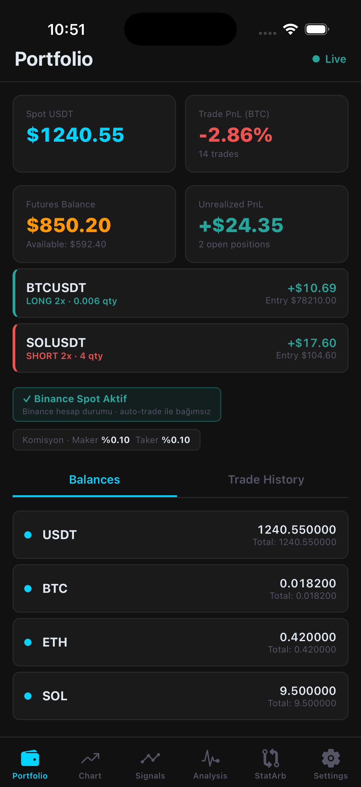
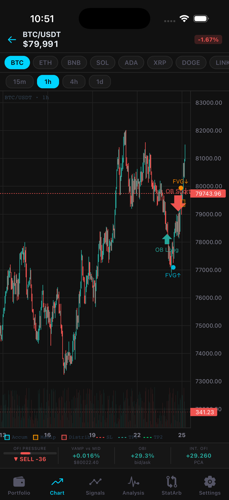
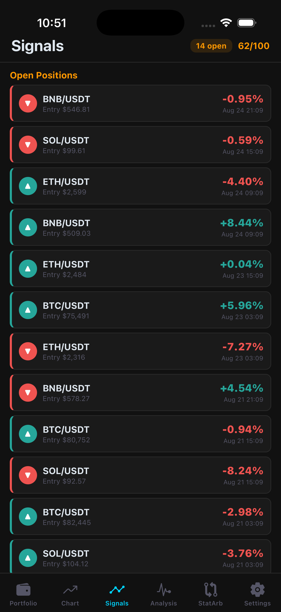
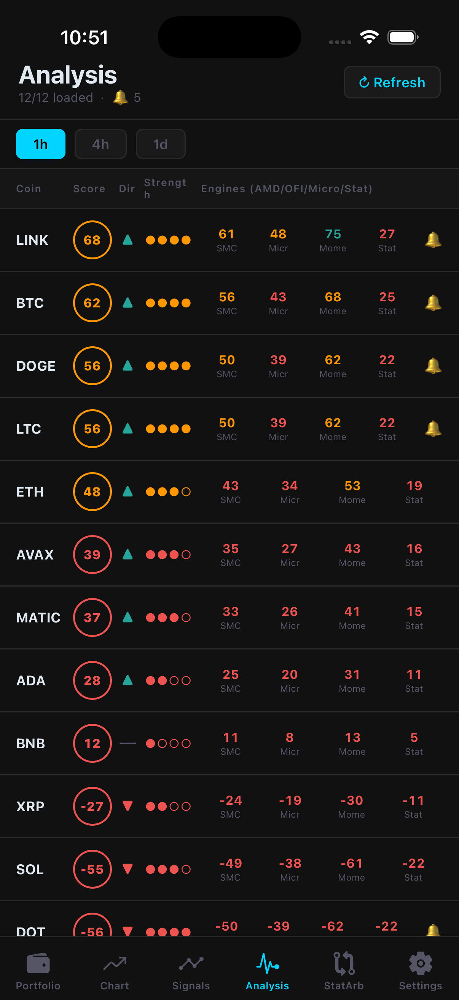
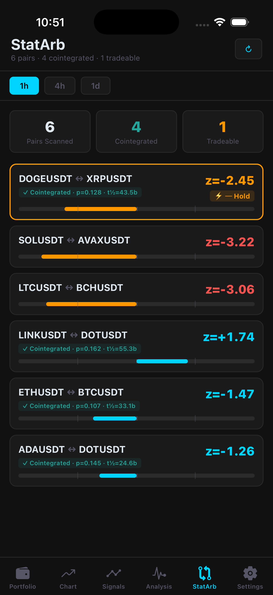
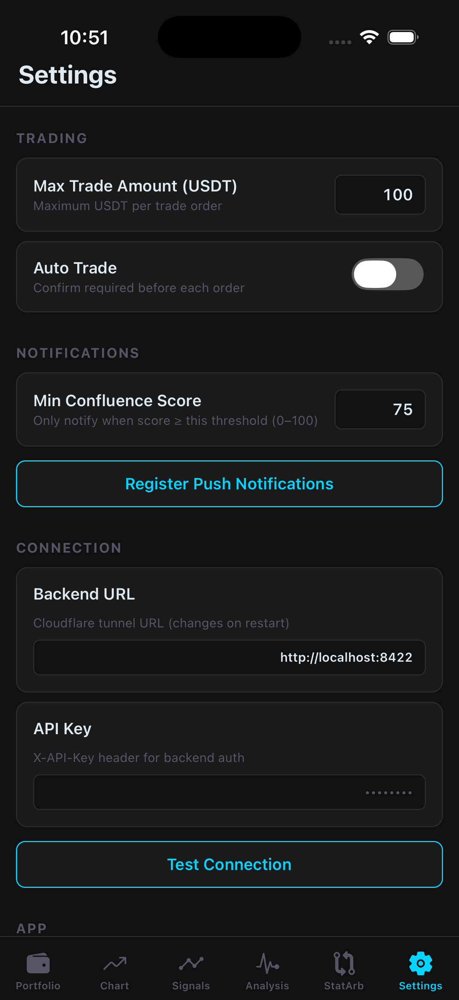

# Crypto Trader Mobile


React Native (Expo) trading cockpit for a **self-hosted crypto analysis &
trading backend**. Connects over a Cloudflare tunnel with an API key and puts
SMC signals, orderbook microstructure, stat-arb scans, and guarded
spot/futures order entry in your pocket.

> The backend (signal engines, Binance connectivity, analysis pipeline) is a
> separate private project and is **not** included in this repo — this app is
> its mobile client.

<p align="center">
  
  
  
</p>
<p align="center">
  
  
  
</p>

## Screens

- **Portfolio** — spot balances, futures account with open LONG/SHORT
  positions and unrealized P&L, trade history with per-trade P&L
- **Chart** — TradingView `lightweight-charts` in a WebView: candlesticks with
  **SMC overlays** (order blocks, fair value gaps, Asia range, Judas sweep)
  plus a live **microstructure bar** (OFI pressure, VAMP vs mid, OBI) refreshed
  every 30s
- **Signals** — SMC signal feed (entry / SL / TP1 / TP2 / R:R) with outcome
  tracking and a $100 simulation: win rate, profit factor, max drawdown, Sharpe
- **Analysis** — per-coin **confluence score** (-100…+100) merging four
  engines: SMC, microstructure, momentum, stat-arb; push notification above a
  configurable threshold
- **StatArb** — pairs scanner: Engle-Granger cointegration (p-value,
  half-life, Hurst), Kalman hedge ratio, spread z-score with signal states
- **Settings** — **max trade amount cap**, auto-trade toggle (confirm before
  each order), min notify score, backend URL + API key (stored in
  `expo-secure-store`)

## Trading guardrails

Order entry goes through a confirmation modal, every order is capped by the
configurable **Max Trade Amount**, and futures leverage is clamped to **3x**
client-side (the backend enforces its own limits too).

## Stack

- Expo + React Navigation (bottom tabs + stack)
- axios against the backend REST API (`X-API-Key` auth over a Cloudflare tunnel)
- `lightweight-charts` inside `react-native-webview` for candlesticks
- `react-native-chart-kit` for equity/spark charts
- `expo-secure-store` for credentials, `expo-notifications` for push

## Run

```bash
npm install
cp .env.example .env   # set EXPO_PUBLIC_TUNNEL_URL + EXPO_PUBLIC_API_KEY
npx expo start
```

The backend URL and API key can also be changed at runtime from the Settings
tab (Test Connection included).

## Status

Personal side project and the trading UI for my own backend setup — not
investment advice, not a product. Use on a trusted network against your own
backend.

## Türkçe özet

Kendi sunucumda çalışan kripto analiz/trading backend'ine Cloudflare tunnel +
API key ile bağlanan React Native (Expo) mobil kokpit. SMC sinyalleri,
orderbook mikro yapısı, cointegration taraması (stat-arb), confluence skoru ve
onay modalı + işlem üst limiti (Max Trade Amount) korumalı spot/futures emir
girişi sunar. Backend bu repoda değildir; kişisel bir yan projedir.
